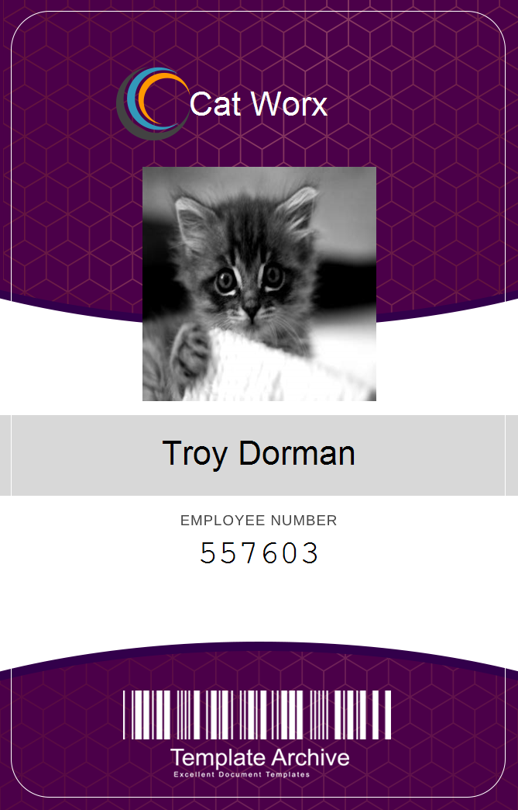
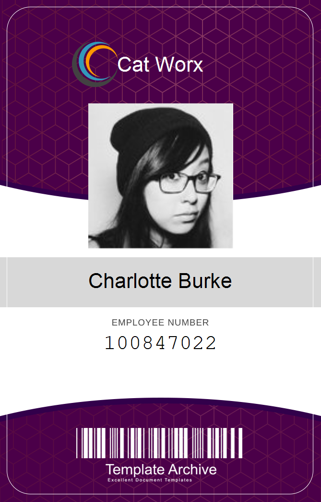
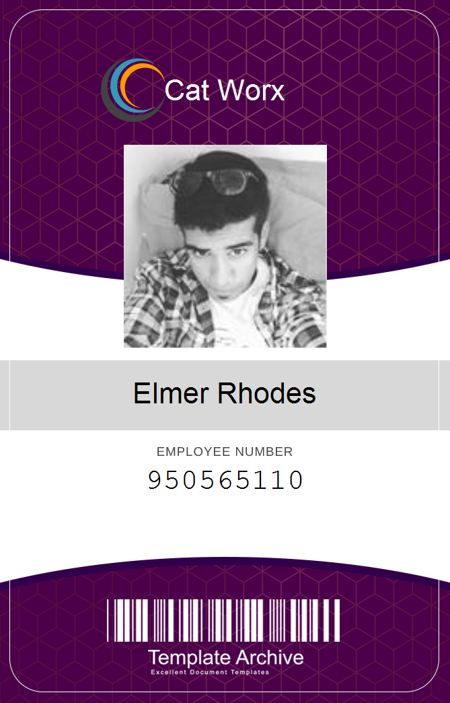
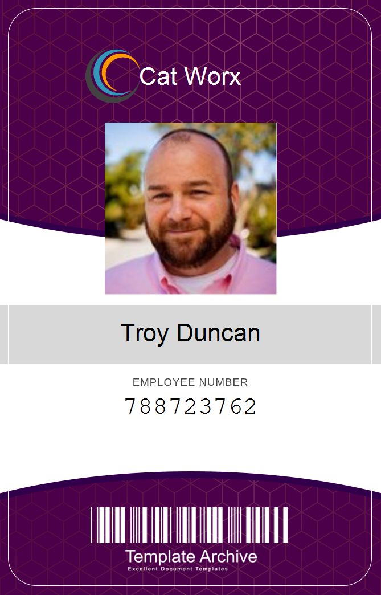

# Catworx - Badgemaker
## C# Security Badge Generator
### Built with: C#, .NET Framework, VS Code, Place Kitten, System.Drawing.Common, Random User Generator API, Newtonsoft.Json 

### Example Images Generated by App:

Summary:

This command line application either takes input from the user, or uses an external API to retrieve randomly generated data to build employee badges for the company Cat Worx.

Using the C# System.Drawing.Common library, a template image is used to superimpose each employee's picture, employee number, and company name to create a brand new image that can then be printed and used to access various parts of the office.

This project gave me a rich understanding of the fundamental C# language.  In it, we utilize many standard features offered by the language: classes, loops, user input, API calls, the "using" keyword, plus much more.

